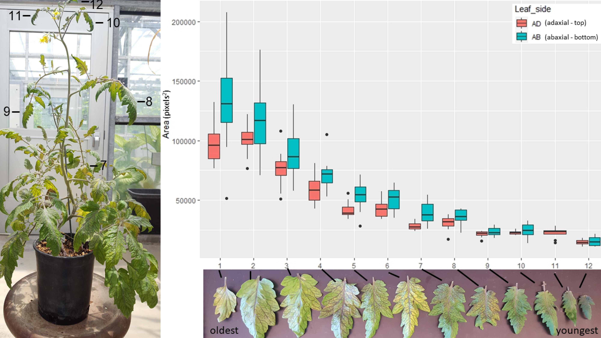

# Leaf_Cell_Shape
Auto-segmentation and analysis of tomato leaf cells   
Scripts written by aednv, analysis by aednv 2019

Leaf epidermal peels are stained with a fluorecent dye and imaged on a confocal microscope. Auto-segmentation and outline selection is done with ImageJ scripts. Individual cell outline jpgs are converted to coordinate objects using the R Momocs package.

##

Measuring leaf cell area of a M82 tomato plant. The terminal leaf of each branch was collected for analysis.

##

Comparing the shape of individual leaf cells between 4 *Solanum* species. Low circularity indicates lobeyness, while high circularity means it is similar to a circle.
